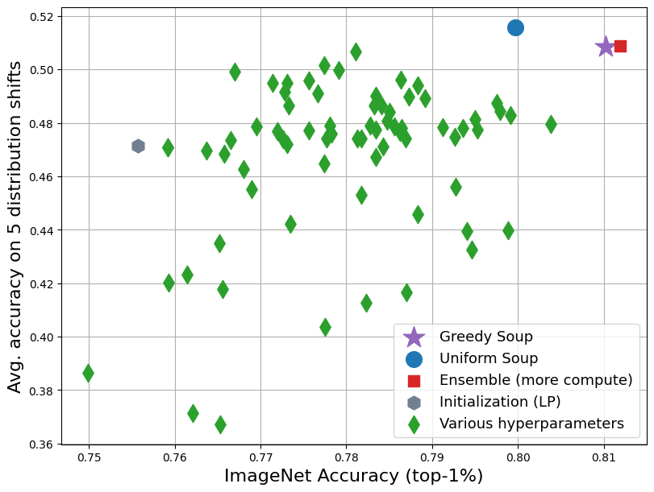

# [Model soups: averaging weights of multiple fine-tuned models improves accuracy without increasing inference time](https://arxiv.org/abs/2203.05482)

This repository contains code for the paper [Model soups: averaging weights of multiple fine-tuned models improves accuracy without increasing inference time](https://arxiv.org/abs/2203.05482).

Using this repository you can reproduce the figure below, which shows that model soups (averaging multiple fine-tuned solutions) can outperform
the best individual model.
As an alternative to this repository, [Cade Gordon](http://cadegordon.io/) has made the following [colab notebook](https://colab.research.google.com/drive/1UmK-phTRXC4HoKb7_rScawnRqlG82svF?usp=sharing) to explore model soups on CIFAR10.
<p align="center">

</p>


## Code

There are 5 steps to reproduced the figure above: 1) downloading the models, 2) evaluating the individual models, 3) running the uniform soup, 4) running the greedy soup, and 5) making the plot.

Note that any of these steps can be skipped, i.e, you can immediately generate the plot above via `python main.py --plot`.
You can also run the greedy soup without evaluating the individual models.
This is because we have already completed all of the steps and saved the results files in this repository (i.e., `individual_model_results.jsonl`).
If you do decide to rerun a step, the corresponding results file or plot is deleted and regenerated.

The exception is step 1, downloading the models. If you wish to run steps 2, 3, or 4 you must first run step 1.

### Install dependencies and downloading datasets

To install the dependencies either run the following code or see [environment.md](environment.md) for more information.
```bash
conda env create -f environment.yml
conda activate model_soups
```

To download the datasets see [datasets.md](datasets.md). When required, set `--data-location` to the `$DATA_LOCATION` used in [datasets.md](datasets.md).

### Step 1: Downloading the models

```bash
python main.py --download-models --model-location <where models will be stored>
```
This will store models to `--model-location`.


### Step 2: Evaluate individual models

```bash
python main.py --eval-individual-models --data-location <where data is stored> --model-location <where models are stored>
```
Note that this will first delete then rewrite the file `individual_model_results.jsonl`.

### Step 3: Uniform soup

```bash
python main.py --uniform-soup --data-location <where data is stored> --model-location <where models are stored>
```
Note that this will first delete then rewrite the file `uniform_soup_results.jsonl`.

### Step 4. Greedy soup

```bash
python main.py --greedy-soup --data-location <where data is stored> --model-location <where models are stored>
```
Note that this will first delete then rewrite the file `greedy_soup_results.jsonl`.

### Step 5. Plot

```bash
python main.py --plot
```
Note that this will first delete then rewrite the file `figure.png`.

### Note

If you want, you can all steps with:
```bash
python main.py --download-models --eval-individual-models --uniform-soup --greedy-soup --plot --data-location <where data is stored> --model-location <where models are stored>
```

Also note: if you are interested in running ensemble baselines, check out [the ensemble branch](https://github.com/mlfoundations/model-soups/tree/ensemble).

Also note: if you are interested in running a minial example of [wise-ft](https://arxiv.org/abs/2109.01903), you can run `python wise-ft-example.py --download-models`. 

Also note: if you are interested in running minimal examples of zeroshot/fine-tuning, you can run `python zeroshot.py` or `python finetune.py`. See program arguments (i.e., run with `--help`) for more information. Note that these are minimal examples and do not contain rand-aug, mixup, or LP-FT.

### Questions

If you have any questions please feel free to raise an issue. If there are any FAQ we will answer them here.

### Authors

This project is by the following authors, where * denotes equal contribution (alphabetical ordering):
- [Mitchell Wortsman](https://mitchellnw.github.io/)
- [Gabriel Ilharco](http://gabrielilharco.com/)
- [Samir Yitzhak Gadre](https://sagadre.github.io/)
- [Rebecca Roelofs](https://twitter.com/beccaroelofs)
- [Raphael Gontijo-Lopes](https://raphagl.com/)
- [Ari S. Morcos](http://www.arimorcos.com/)
- [Hongseok Namkoong](https://hsnamkoong.github.io/)
- [Ali Farhadi](https://homes.cs.washington.edu/~ali/)
- [Yair Carmon*](https://www.cs.tau.ac.il/~ycarmon/)
- [Simon Kornblith*](https://simonster.com/)
- [Ludwig Schmidt*](https://people.csail.mit.edu/ludwigs/)


## Citing

If you found this repository useful, please consider citing:
```bibtex
@InProceedings{pmlr-v162-wortsman22a,
  title = 	 {Model soups: averaging weights of multiple fine-tuned models improves accuracy without increasing inference time},
  author =       {Wortsman, Mitchell and Ilharco, Gabriel and Gadre, Samir Ya and Roelofs, Rebecca and Gontijo-Lopes, Raphael and Morcos, Ari S and Namkoong, Hongseok and Farhadi, Ali and Carmon, Yair and Kornblith, Simon and Schmidt, Ludwig},
  booktitle = 	 {Proceedings of the 39th International Conference on Machine Learning},
  pages = 	 {23965--23998},
  year = 	 {2022},
  editor = 	 {Chaudhuri, Kamalika and Jegelka, Stefanie and Song, Le and Szepesvari, Csaba and Niu, Gang and Sabato, Sivan},
  volume = 	 {162},
  series = 	 {Proceedings of Machine Learning Research},
  month = 	 {17--23 Jul},
  publisher =    {PMLR},
  pdf = 	 {https://proceedings.mlr.press/v162/wortsman22a/wortsman22a.pdf},
  url = 	 {https://proceedings.mlr.press/v162/wortsman22a.html}
}


```
